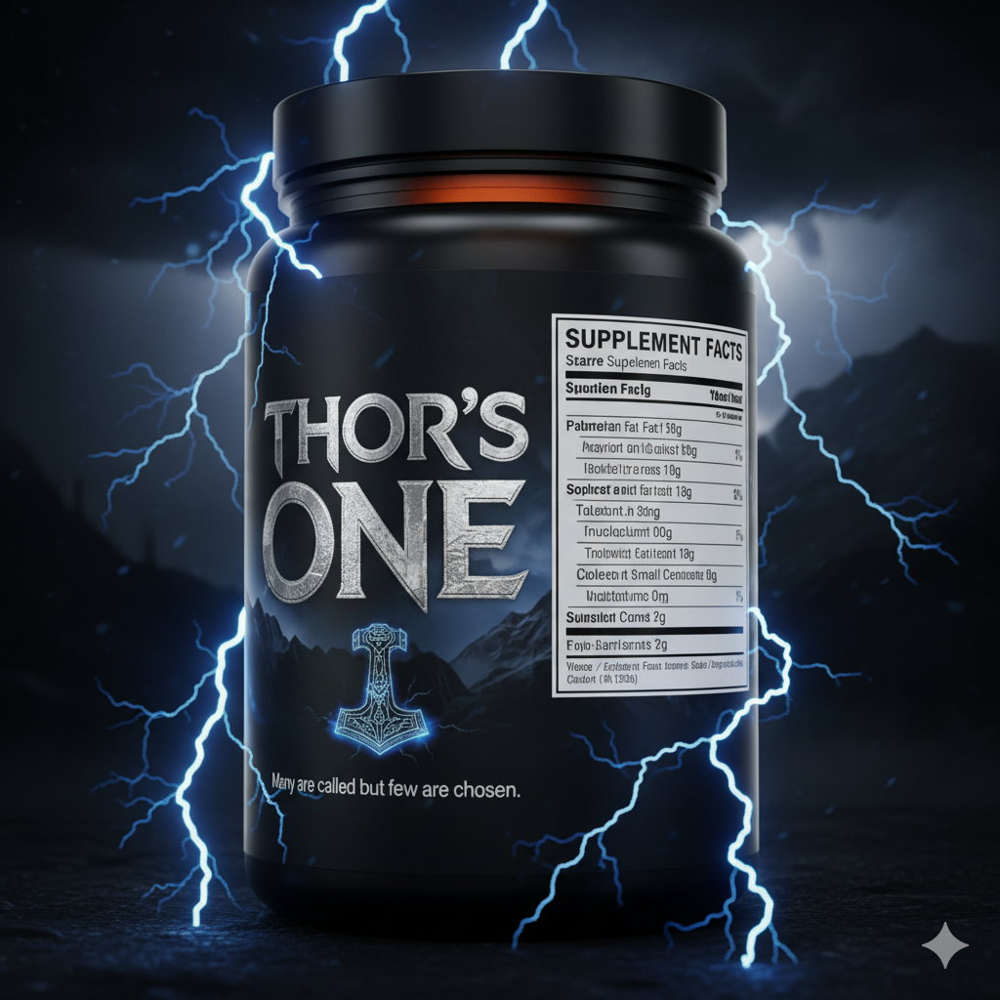
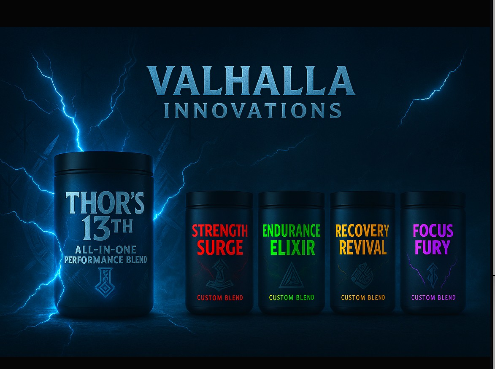

    

    VALHALLA INNOVATIONS // NODE: FLORA-WICHITA // ACTIVE

    <header>
        <h1>VALHALLA</h1>
        
INNOVATIONS

    </header>

    

        

            
Available

            
            <h3 style="font-family: 'Orbitron';">THOR'S ONE</h3>
            
13-Ingredient Clean Alloy

            <a href="thors-one" class="btn">Access Alloy</a>
        

        

            
In Forge

            
            <h3 style="font-family: 'Orbitron'; color: #444;">STRENGTH SURGE</h3>
            <a href="strength-surge" class="btn" style="border-color: #333; color: #333;">Locked</a>
        

    

    <footer>
        MCLAREN VALHALLA SYSTEMS // TRACKING NODE 01 // SECURE SESSION ACTIVE
    </footer>

