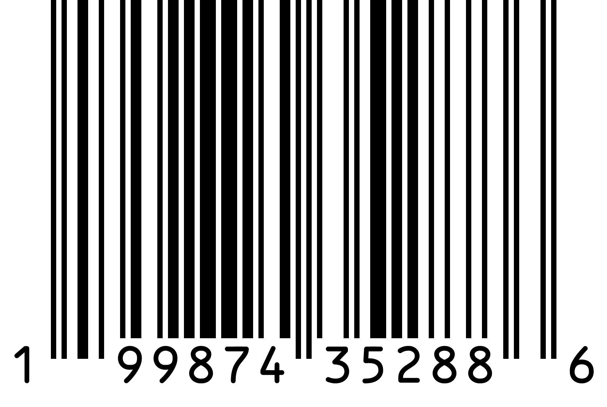

    
    
    <h1>THOR'S ONE</h1>
    
MANY ARE CALLED BUT FEW ARE CHOSEN

    
    <a href="https://www.paypal.com/ncp/payment/Z6NLB5ECC653L" class="order-btn">CLAIM THE ALLOY</a>

    

        <h2>Supplement Facts</h2>
        
Serving Size: 1 Scoop / Servings Per Container: 30

        
        <table class="sf-table">
            <tr class="sf-sub-header"><td colspan="2">CORE PERFORMANCE ALLOY</td></tr>
            <tr><td>Creatine Monohydrate (200 Mesh Micronized)</td><td style="text-align:right;">5 g</td></tr>
            <tr><td>Citrulline Malate</td><td style="text-align:right;">5 g</td></tr>
            <tr><td>Beta-Alanine</td><td style="text-align:right;">3.5 g</td></tr>
            <tr><td>BCAA (2:1:1 Leucine, Isoleucine, Valine)</td><td style="text-align:right;">3.5 g</td></tr>
            <tr><td>Betaine Anhydrous</td><td style="text-align:right;">2 g</td></tr>
            <tr><td>L-Glutamine</td><td style="text-align:right;">2 g</td></tr>
            <tr><td>Beet Juice Powder</td><td style="text-align:right;">1.5 g</td></tr>
            <tr><td>L-Carnitine L-Tartrate</td><td style="text-align:right;">1,000 mg</td></tr>
            <tr><td>HMB</td><td style="text-align:right;">750 mg</td></tr>
            <tr><td>Taurine</td><td style="text-align:right;">500 mg</td></tr>
            
            <tr class="sf-sub-header"><td colspan="2">NEURO-FOCUS & STABILITY</td></tr>
            <tr><td>L-Tyrosine</td><td style="text-align:right;">750 mg</td></tr>
            <tr><td>Magnesium Glycinate</td><td style="text-align:right;">300 mg</td></tr>
            <tr><td>Huperzine A (1%)</td><td style="text-align:right;">200 mcg</td></tr>
            
            <tr class="sf-sub-header"><td colspan="2">ELECTROLYTE RECOVERY</td></tr>
            <tr><td>Sodium</td><td style="text-align:right;">138 mg (6% DV)</td></tr>
            <tr><td>Potassium</td><td style="text-align:right;">141 mg (3% DV)</td></tr>
        </table>
        
        

            
            
VERIFIED BATCH: 001 // VALHALLA AUTHENTIC

        

    

    <footer style="margin-top: 80px; color: #333; font-size: 0.7rem; letter-spacing: 4px; font-weight: bold;">
        VALHALLA INNOVATIONS // NODE: SUPPS-01 // SECURE SESSION ACTIVE
    </footer>

